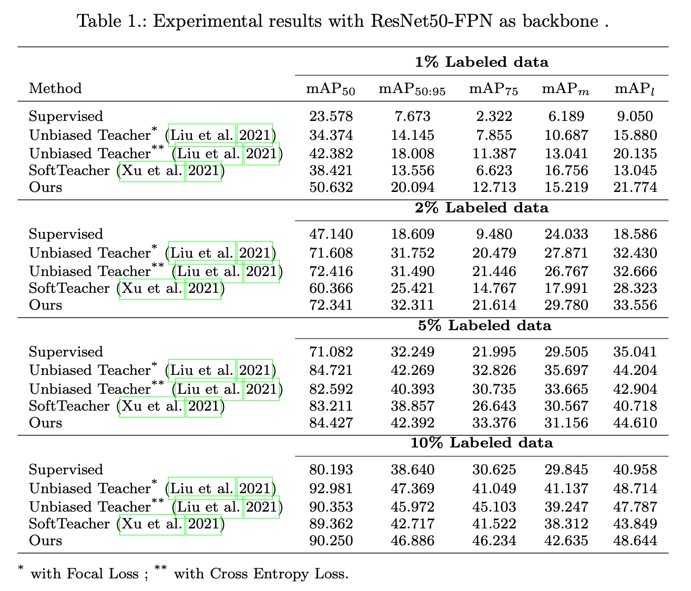
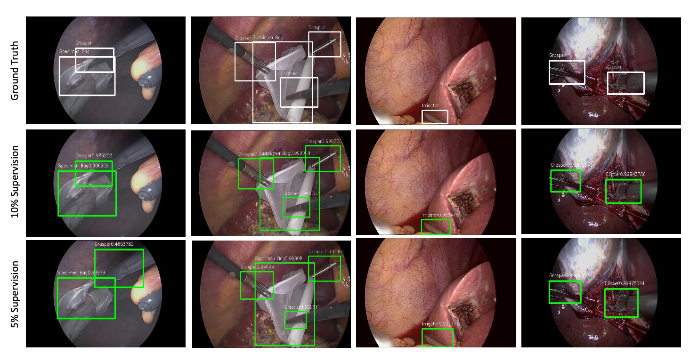

# Semi-supervised-surgical-tool-detection
This repository contains code for our paper titled "A semi-supervised teacher-student framework for surgical tool detection and localization"

in this paper we introduce a semi-supervised learning (SSL) framework in surgical tool detection paradigm which aims to mitigate the scarcity of training data and the data imbalance through a knowledge distillation approach. In our framework, we train a model with labeled data which initialises the teacher-student joint learning, where the student is trained on teacher-generated pseudo labels from unlabeled data. We propose a multi-class distance with a margin based classification loss function in the region-of-interest head of the detector to effectively segregate foreground classes from background region


## Results




## Dataset Download 
m2cai16-tool locations dataset can be downloaded [here](https://ai.stanford.edu/~syyeung/tooldetection.html)
Dataset annotations are in VOC format. However, this work uses coco format. All the required code files for voc to coco conversion can be found in data folder. 

The folder structure to keep images and labels is given as follows. 

```sh
 |--Tool_detection
    |-- Datasets
        |-- coco
            |-- train2017
            |-- val2017
            |-- test2017
        |-- annotations
            |-- instance_train2017.json
            |-- instances_val2017.json
            |-- instances_test2017.json
   ```

## Installation
### Build Environment 
 ```sh
 # create conda env
 conda create -n tool python=3.6 
 # activate the enviorment 
 conda activate tool
 # install PyTorch >=1.5 with GPU 
 conda install pytorch torchvision -c pytorch 
 # install detectron2 
 https://github.com/facebookresearch/detectron2/blob/main/INSTALL.md   
   ```


## Training 
* To train the network on 1% labeled data setting, use following. <br />
```sh
  CUDA_VISIBLE_DEVICES =1,2 python train_net.py \
                                    --num-gpus 2 \
                                    --config configs/coco_supervision/faster_rcnn_R_50_FPN_sup1_run1.yaml \
                                    SOLVER.IMG_PER_BATCH_LABEL 4 SOLVER.IMG_PER_BATCH_UNLABEL 4
  ```
* Just change the config file to train on different percentages of labeled set. <br />

## Evaluation
* To evaluate the model, use the following. <br />
```sh
CUDA_VISIBLE_DEVICES =1,2 python train_net.py \
                                  --eval-only \
                                  --num-gpus 2 \
                                  --config configs/coco_supervision/faster_rcnn_R_50_FPN_sup1_run1.yaml\
                                  SOLVER.IMG_PER_BATCH_LABEL 4 SOLVER.IMG_PER_BATCH_UNLABEL 4 \
                                  MODEL.WEIGHTS path_to_checkpoint/checkpoint \
                                  
 ```
 
 ## Resume Training
* To resume model training, use the following. <br />
```sh
CUDA_VISIBLE_DEVICES =1,2 python train_net.py \
                                  --resume \
                                  --num-gpus 2 \
                                  --config configs/coco_supervision/faster_rcnn_R_50_FPN_sup1_run1.yaml\
                                  SOLVER.IMG_PER_BATCH_LABEL 4 SOLVER.IMG_PER_BATCH_UNLABEL 4 \
                                  MODEL.WEIGHTS path_to_checkpoint/checkpoint \
                                  
 ```

## Model weights

| Backbone  | Supervision       |  Batch Size                | mAP_50:95      |  Model Weights       |
| ------------- | ------------- | -------------              |  ------------- |   -------------      |
| ResNet50-FPN  | 1%            | 4 labeled + 4 unlabeled    |      20.094          |     [link](https://drive.google.com/file/d/1g3yEILz2bY--PYE8M4PpPxeUPh7Ky5Gb/view?usp=sharing)               |
| ResNet50-FPN  | 2%            | 4 labeled + 4 unlabeled    |      32.311         |     [link](https://drive.google.com/file/d/1iFXRk6E08BaLxt3CQ_yBFpp7a_w3vFcj/view?usp=sharing)               |
| ResNet50-FPN  | 5%            | 4 labeled + 4 unlabeled    |      42.392        |     [link](https://drive.google.com/file/d/1j5LcmOsI7Qs7ZNEAvvhr2T0Yn5mRktpJ/view?usp=sharing)              |
| ResNet50-FPN  | 10%           | 4 labeled + 4 unlabeled    |      46.886       |      [link](https://drive.google.com/file/d/1jtFxCn60DK7Ioy49Xqt4Yn2NHxsMTcN8/view?usp=sharing)         |


## Citing semi-supervised tool detection


## FAQ
If anyone wants to reproduce the code and encounters a problem or wants to give a suggestion, feel free to contact me at my email [a01753093@tec.mx]
